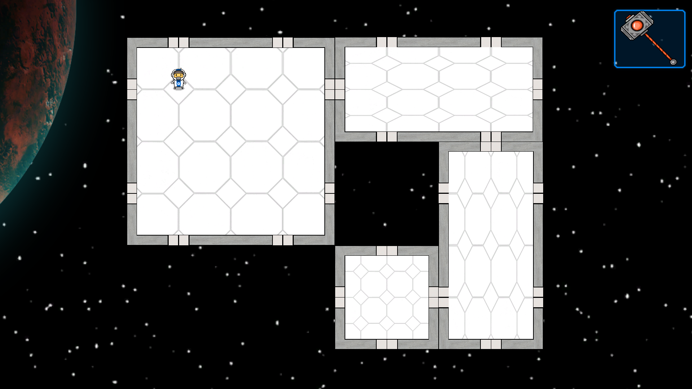

# Sideralis: Beyond The Unknown

## Story

In the year 2087, humanity has exhausted the Earth's resources and faces imminent collapse. A group of visionaries and scientists launch the Sideralis project, an ambitious plan to build an interstellar base that can sustain human life and explore the galaxy. You are the commander of the Sideralis base, responsible for its growth, survival, and expansion.

At the beginning of the game, your base is small and vulnerable, orbiting Earth and dependent on supplies sent from the ground. As you progress, you will research new technologies, recruit crew members, and build modules to improve the base's capabilities. You will also face challenges such as space debris, solar flares, and alien threats that can damage your base or kill your crew.

As your base becomes more self-sufficient, you can send out exploration and colonization missions to nearby star systems. Each system has its own planets with unique environments and resources, as well as potential allies or enemies. You can choose to trade, negotiate, or fight with other species, depending on your goals and values.

The ultimate goal of Sideralis is to find a new home for humanity, whether it's a habitable planet, a space habitat, or a transdimensional portal. Along the way, you will discover the secrets of the universe, encounter ancient artifacts and mysteries, and face ethical dilemmas that test your leadership skills.

### Used technologies:
1. [C#](https://learn.microsoft.com/en-us/dotnet/csharp/)
2. [Unity](https://docs.unity.com/)

### Project Features:
- Building System
- Crew Control

### How to Run the Project?
1. Clone the [Repo](https://github.com/CatalinCatta/Sideralis.git).
2. Run test/Sideralis.exe
3. Have Fun!

